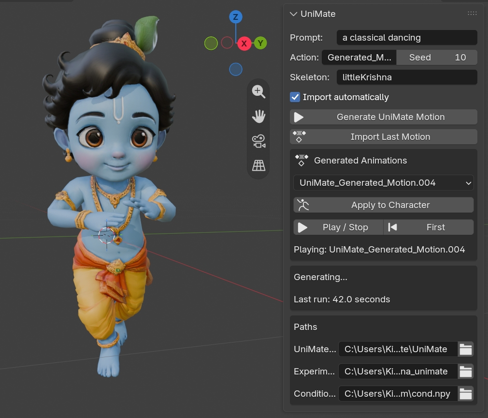

# UniMate Blender Add-on

Generate text-guided skeletal animations with UniMate and apply them directly
to a rigged character as selectable Blender Actions.



> [!IMPORTANT]
> The original UniMate authors have released their code and datasets, but they
> have **not released an official pretrained checkpoint yet**. This add-on is
> tested with the independently trained, third-party checkpoint at
> [`tarn59/UniMate-Weights`](https://huggingface.co/tarn59/UniMate-Weights).
> It is not an official UniMate checkpoint, and this project is not affiliated
> with or endorsed by the UniMate authors.

## Features

- Enter a natural-language motion prompt inside Blender.
- Run UniMate inference on an NVIDIA GPU without installing PyTorch into Blender.
- Load the smaller EMA SafeTensors inference weights.
- Automatically import generated motion as a new Blender Action.
- Choose the target character armature from a scene-aware dropdown.
- Choose common motion prompts from the Action dropdown, or use Custom.
- List available profiles under the user-facing **UniMate Skeleton** selector.
- Select any generated action from a dropdown.
- Apply, play, stop, and return to the first frame from the sidebar.
- Preserve the character's existing actions.
- Record the prompt, seed, source file, runtime, and inference log.
- Includes a prepared `littleKrishna` example character and conditioning data.

## System requirements

| Component | Requirement |
|---|---|
| Operating system | Windows 10/11 tested; Linux should work with the correct Python path |
| Blender | 5.2 LTS tested |
| Python environment | Python 3.10 for UniMate |
| GPU | NVIDIA CUDA GPU; 8 GB VRAM recommended |
| Tested GPU | RTX 3060 Ti 8 GB |
| System RAM | 16 GB minimum; 32 GB recommended |
| Free storage | Approximately 8–12 GB for UniMate, CUDA PyTorch, T5, and weights |
| Internet | Required for initial downloads |

Our RTX 3060 Ti test generated a 60-frame clip in approximately 26–40 seconds,
after the first-run model downloads. Performance and motion quality vary by GPU,
prompt, skeleton, seed, and checkpoint.

## Repository contents

```text
unimate_blender/                 Blender add-on
config/littleKrishna_config.json Example UniMate experiment configuration
example_assets/littleKrishna/    Demo FBX, canonical FBX, cond and rest motion
docs/unimate-panel.jpg           Interface screenshot
```

Model weights are deliberately excluded from GitHub.

## 1. Install UniMate

Clone the official code:

```bash
git clone https://github.com/Friedrich-M/UniMate.git
cd UniMate
```

Create the environment following the
[official UniMate instructions](https://github.com/Friedrich-M/UniMate):

```bash
conda create -n unimate python=3.10 -y
conda activate unimate
pip install "setuptools<81"
pip install -r requirements.txt --no-build-isolation
```

The add-on launches this external environment. Blender's bundled Python remains
clean and does not need CUDA PyTorch.

## 2. Download the third-party weights

Install the Hugging Face CLI if it is unavailable:

```bash
pip install -U huggingface_hub
```

Download only the lightweight inference files:

```bash
hf download tarn59/UniMate-Weights \
  model_ema.safetensors dataset_stats.npy \
  --local-dir outputs/uniml3d_60frames_graph_adaln
```

`model_ema.safetensors` is approximately 283 MB. The add-on includes a small
runner that loads it directly. You do **not** need the 1.18 GB optimizer/training
checkpoint for add-on inference.

The checkpoint was independently trained by `tarn59`; read its model card and
license before use:
[`tarn59/UniMate-Weights`](https://huggingface.co/tarn59/UniMate-Weights).

## 3. Prepare the included example

From this repository, copy the example feature directory into UniMate:

```text
example_assets/littleKrishna/cond.npy
    → UniMate/dataset/features/custom/cond.npy

example_assets/littleKrishna/littleKrishna-rest.npz
    → UniMate/dataset/features/custom/motions/littleKrishna-rest.npz
```

Create the experiment directory and copy:

```text
config/littleKrishna_config.json
    → UniMate/outputs/littleKrishna_unimate/config.json

UniMate/outputs/uniml3d_60frames_graph_adaln/dataset_stats.npy
    → UniMate/outputs/littleKrishna_unimate/dataset_stats.npy
```

The included files are already prepared for the skeleton identifier
`littleKrishna`. The original and canonical example FBXs are under
`example_assets/littleKrishna/`.

## 4. Install the Blender add-on

1. Download this repository or its release ZIP.
2. Zip the `unimate_blender` folder by itself if needed.
3. In Blender, open **Edit → Preferences → Add-ons**.
4. Choose **Install from Disk** and select the ZIP.
5. Enable **UniMate Motion Generator**.
6. Open **3D Viewport → Sidebar (`N`) → UniMate**.

## 5. Configure the sidebar

Set these paths:

- **UniMate Root:** cloned official UniMate directory.
- **Python:** the UniMate environment's Python executable. Leave empty when
  using `UniMate/.venv` with the standard platform layout.
- **Experiment:** `UniMate/outputs/littleKrishna_unimate`.
- **SafeTensors:** downloaded `model_ema.safetensors`.
- **Conditioning:** copied `dataset/features/custom/cond.npy`.
- **Skeleton:** `littleKrishna` for the bundled example.

Choose the scene rig under **Character**, select an **Action** preset (or
**Custom**), choose a **UniMate Skeleton**, and press
**Generate UniMate Motion**. The first run also downloads
`google/flan-t5-base`, so it takes longer.

When generation completes, the new action appears under **Generated
Animations**. Select it, press **Apply to Character**, then **Play / Stop**.

## Using another character

UniMate needs topology conditioning matching the target skeleton. A random FBX
cannot be used by changing only the skeleton text field.

1. Ensure the character is rigged and has a valid armature.
2. Use UniMate's preprocessing pipeline to create `cond.npy`, a canonical FBX,
   and a rest/reference motion.
3. Keep the skeleton within the checkpoint's configured joint limit. The
   included experiment supports up to 61 padded joints; the example uses a
   22-joint Mixamo-style core.
4. Point the add-on to the new conditioning file and matching experiment config.
5. Select its key from **UniMate Skeleton**. The dropdown is populated
   directly from `cond.npy`.

The **Character** dropdown and **UniMate Skeleton** dropdown serve different
purposes. Character is the Blender armature that receives keyframes. Conditioned
UniMate Skeleton is the preprocessed rig data used during inference. Renaming an
armature does not create compatible conditioning data.

Finger/helper bones may need pruning or weight merging before preprocessing.
Always keep a backup of the original character.

## Output layout

Each run is stored under:

```text
UniMate/outputs/blender_plugin/YYYYMMDD_HHMMSS/
├── cases.json
├── unimate.log
├── captions.json
└── motions/*.npy
```

Imported actions receive `unimate_prompt` and `unimate_source` custom metadata.

## Troubleshooting

### Generate button immediately reports a path error

Verify that the external Python executable, UniMate root, experiment directory,
SafeTensors file, and `cond.npy` all exist.

### CUDA is unavailable

Run this inside the UniMate environment:

```bash
python -c "import torch; print(torch.cuda.is_available(), torch.cuda.get_device_name(0))"
```

Reinstall the CUDA-enabled PyTorch build if it prints `False`.

### No motion is produced

Open the `unimate.log` file in the timestamped output folder. Common causes are
an incorrect skeleton key, mismatched conditioning/configuration, or insufficient
VRAM.

### Action is generated but does not affect the mesh

- Select the correct armature or its skinned mesh.
- Confirm bone names correspond to the conditioning data.
- Check that the mesh has an Armature modifier targeting that armature.
- Apply the action through the add-on dropdown.

### The first run is very slow

The T5 text encoder downloads and initializes on first use. Later runs reuse the
local Hugging Face cache.

## Status and limitations

- Experimental research integration, not an official UniMate product.
- Tested with Blender 5.2 LTS and an RTX 3060 Ti.
- Generates fixed 60-frame clips with the included experiment.
- The third-party checkpoint has no official UniMate evaluation guarantees.
- Retargeting quality depends strongly on skeleton preparation and bone naming.

## Licensing

The add-on source is released under the MIT License; see [LICENSE](LICENSE).

The included character FBX and derived conditioning files are demonstration
assets and are **not covered by the add-on's MIT license**. See
[`example_assets/littleKrishna/ASSET_LICENSE.md`](example_assets/littleKrishna/ASSET_LICENSE.md).

UniMate, its datasets, the T5 encoder, and the third-party checkpoint retain
their respective licenses and terms. Users are responsible for reviewing them,
especially before commercial use.

## Credits

- [UniMate: One Unified Model to Animate Diverse Skeletons](https://github.com/Friedrich-M/UniMate)
- Mou et al., SIGGRAPH Asia 2026, arXiv:2609.05415
- Independent checkpoint: [`tarn59/UniMate-Weights`](https://huggingface.co/tarn59/UniMate-Weights)

If you publish research using UniMate, cite the original UniMate paper as
requested by its authors.
